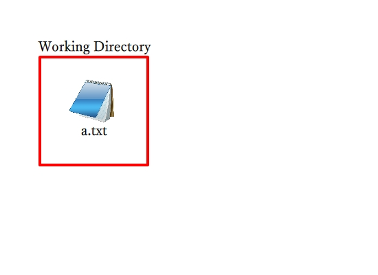
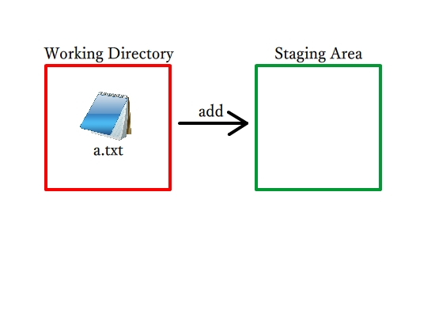
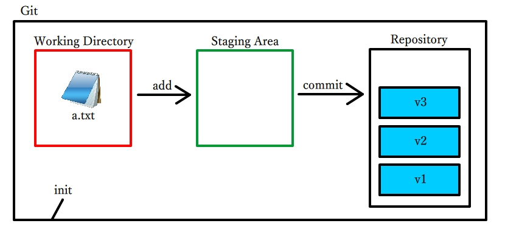
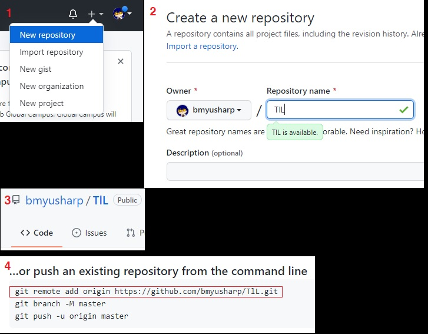
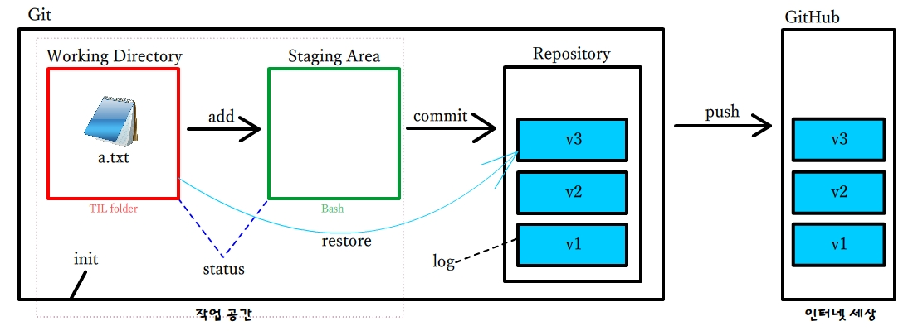

# git 기본개념

## git

우리가 컴퓨터에서 무언가를 작업하고 있습니다.



그 파일은 a라는 텍스트 파일입니다.

우리가 이 파일을 날려버리거나, 컴퓨터가 불타버리는 위험으로부터 파일을 보호하기 위해 파일을 백업하기도 하지만, 버전 관리를 위해서도 `git`을 사용합니다.

`working directory`는, 우리가 작업을 진행하는 로컬입니다. 이해하기 쉽게 예를 들자면, 새 폴더(=TIL) 라고 이해하면 됩니다.



여기에서 git에 저장하기 위해 ` staging area`에 올립니다. 수업 중에는 Git Bash를 이용해서 진행하였는데요, 이 과정을 `add`라고 합니다.

그 다음 저장소(`repository`)에 버전으로 만들기 위해 `commit`을 하면 컴퓨터 내의 git에 버전이 저장됩니다.

그런데 맨 처음, `add`하기 전에 해야 할 일이 있습니다. 내 컴퓨터에  git을 만들어야 하니까요. `init`을 만들어주면 될 것입니다.


init을 만들어주고 나면 staging area에 파일들이 add될 수 있습니다. 그리고 작업이 완료되면, 파일들을 commit합니다. 파일들은 버전이 되어 repository에 저장되고, git이 됩니다.



여기까지의 과정을 코드로 보면 이렇습니다.

```bash
$ git init #init 생성
$ git add a.txt #파일을 staging area에 add
$ git commit -m 'Add a.txt' #commit과 동시에 커밋명 기록
```

아직은 컴퓨터 안에 있는 git에 버전을 저장하는 단계입니다. 이렇게 저장을 마치고 난 뒤라면 고양이가 와서 작업물을 다 지워 버려도 `.git`이 멀쩡하다면 다시 살릴 수 있습니다. 

하지만 컴퓨터가 폭발한다면 여전히 작업물이 사라지는 건 마찬가지고, 다른 사람과의 협업도 아직은 불가능합니다.


## GitHub

깃허브는 개발자들이 작업물을 기록하거나 협업하기 위해 만든 인터넷 서버 중 하나입니다. **원격 저장소**라고 부릅니다. GitHub에 버전들을 보내는 것을 `push`라고 합니다.



다음 2번까지의 과정을 통해 GitHub에서 Repository를 생성해 줍니다.

그 다음 4번 이미지를 보시면 "...or `push` an existing repository from the command line" 이 보입니다. 여기서 'git remote ~ TlL.git' 부분을 복사해줍니다.

그리고 bash를 켜서 코드를 붙혀넣습니다. (ctrl + V가 안 되고, shift + insert 사용)

```bash
$ git remote add origin https://github.com/bmyusharp/TlL.git
# github.com/ 뒤로는 자신의 이름과 레포지토리명에 따라 다릅니다.
```

추가되었으면, GitHub에 push할 일만 남았습니다.

```bash
$ git push origin master #버전을 푸시합니다. 
```

푸시가 완료되면 GitHub에 버전이 올라가서 볼 수 있게 됩니다.

단, init의 Repository에 commit된 버전만 올라가기 때문에, commit되지 않은 파일들은 GitHub에서 볼 수 없을 뿐만 아니라 컴퓨터의 저장소에서도 볼 수 없습니다.

그림으로 보면 이렇습니다.




## 그 외의 것

위의 그림을 보시면 `status`나 `restore`, `log`는 언급하지 않았었습니다.

status는 작업공간과 대기공간(Staging Area)에서 파일들이 add되었는지 안되었는지,

log는 저장소에 버전들이 어떤 게 있는지, commit 메시지가 어떻게 되는지를 볼 수 있는 명령어이고,

restore는 파일을 버전에 있는 단계로 돌려올 수 있습니다. 화살표 방향이 파일에서 버전으로 향하는 이유에 관해서는, 버전 속에서 파일을 찾아서 정보를 되돌려받기 때문입니다.

`HEAD`라는 개념이 있는데, 여러개의 버전 중 현재 보고 있는 버전을 가리키는 것을 HEAD라고 합니다. 크롬의 GUI로 예를 들면 현재 탭이라고 보면 됩니다.


코드와 출력메시지 자세히 보기는 교수님의 정리를 참고하시길 바랍니다.

[Git 기초 2일차 오전](https://hphk.notion.site/Git-2-b1fc30b12e2a4193b6465ebde15e7b9d)

[Git 기초 2일차 오후 (원격저장소)](https://hphk.notion.site/Git-2-2a9a8dd957234126b24ba3012db5d63c)


위에 commit 메시지라는 표현을 썼는데, commit할 때 입력할 문구는 이후 버전관리 및 협업 시 가독성을 위해 보편적으로 좋은 메시지로 작성될 필요가 있습니다. 다음을 읽어보시면 좋습니다. (10min)

[좋은 git 커밋 메시지를 작성하기 위한 7가지 약속](https://meetup.toast.com/posts/106)

